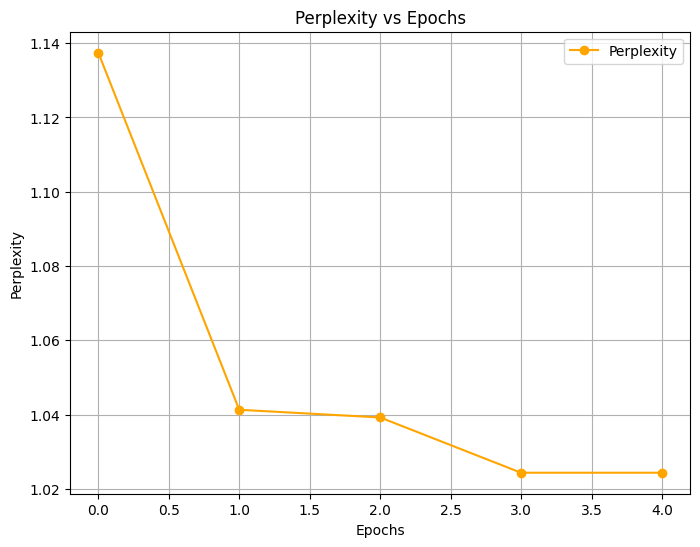
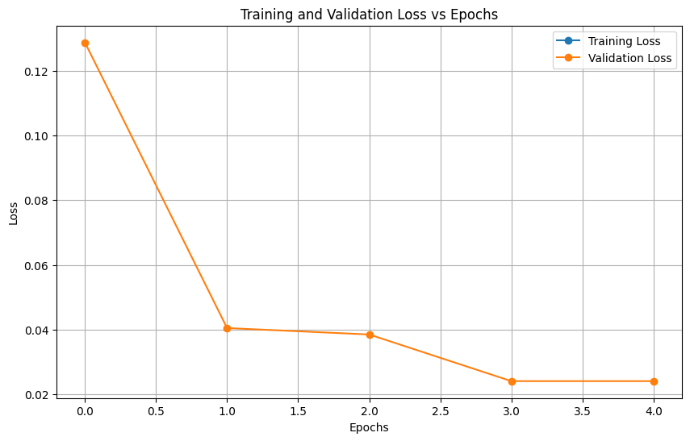
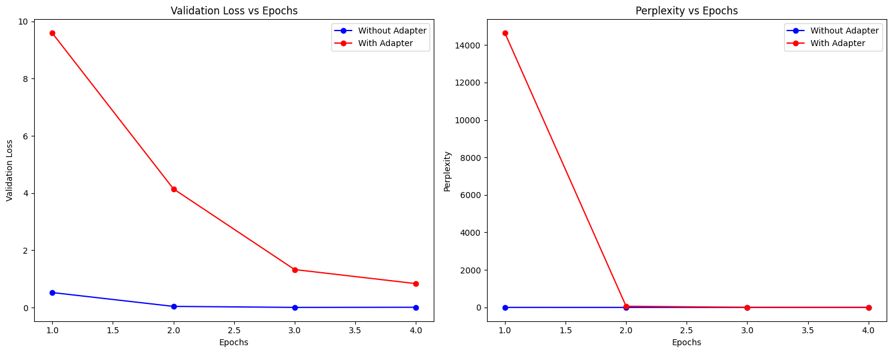

# **AI-Based Interpretation of Vedic Texts using MuRIL**
Fine-tuning the MuRIL model on Sanskrit texts from the Atharva Veda to provide personalized life guidance based on Vedic wisdom.


---

## **📌 Project Overview**
This project explores the application of **Natural Language Processing (NLP)** to interpret ancient Hindu Vedic scriptures, specifically the **Atharva Veda**. By leveraging the **MuRIL (Multilingual Representations for Indian Languages) model**, we fine-tune it on Sanskrit text to generate **personalized life guidance based on Vedic principles**.

### **Key Features:**
- ✅ **Fine-tuning MuRIL** on Sanskrit text from the **Atharva Veda (KANDA-1)** dataset.
- ✅ **Comparing tokenization strategies** between **MuRIL, BERT, SanBERT, and ByT5**.
- ✅ **Perplexity optimization**, reducing it from **1.14 to 1.02** for enhanced text understanding.
- ✅ **Experimenting with adapter layers** to improve computational efficiency while maintaining accuracy.
- ✅ **Developing a robust NLP pipeline** for Sanskrit text processing, including **tokenization, normalization, and dynamic masking**.

---

## **🛠️ Tech Stack**
- **Python**
- **PyTorch** & **Hugging Face Transformers**
- **MuRIL, BERT, SanBERT, ByT5**
- **NLP Tokenization & Adapter Layers**
- **Atharva Veda Sanskrit Text Processing**
- **Jupyter Notebook**

---

## **📂 Repository Structure**
```
📦 AI-for-Vedic-Scriptures
├── 📜 ENPM703_FinalProj.ipynb   # Jupyter Notebook with training & evaluation
├── 📄 ENPM_703_Final_Report.pdf  # Full project report
├── 📁 data/                      # Sanskrit dataset (if public)
├── 📁 models/                    # Saved fine-tuned MuRIL models
├── 📁 results/                   # Visualizations & performance graphs
├── 📜 requirements.txt           # Dependencies
└── 📜 README.md                  # This file
```

---

## **📊 Results**
### **Training Performance:**
- **Initial perplexity:** `1.14`
- **Final perplexity:** `1.02`
- **Validation loss improvement:** `0.527 → 0.0134`

### **Adapter vs. Fine-Tuned Model:**
| Model Variant       | Validation Loss | Perplexity |
|--------------------|----------------|------------|
| MuRIL (Fine-tuned) | 0.0134         | 1.0134     |
| MuRIL + Adapter   | 0.840          | 2.3168     |

### **Observations:**
  
 
  

---

## **🚀 How to Run**
### **1️⃣ Install Dependencies**
```bash
pip install -r requirements.txt
```

### **2️⃣ Load the Jupyter Notebook**
Run `VedasGPT.ipynb` to see training and evaluation steps.

### **3️⃣ Inference Example**
```python
from transformers import AutoModelForMaskedLM, AutoTokenizer
import torch

model_name = "path_to_your_fine_tuned_model"
tokenizer = AutoTokenizer.from_pretrained(model_name)
model = AutoModelForMaskedLM.from_pretrained(model_name)

text = "धनं [MASK] समृद्धिं याति।"  # Sanskrit sentence with masked token
inputs = tokenizer(text, return_tensors="pt")
outputs = model(**inputs)

predicted_token = tokenizer.decode(torch.argmax(outputs.logits, dim=-1)[0])
print(predicted_token)
```

---

## **📖 Dataset**
- **KANDA-1**: A dataset derived from **Atharva Veda**, containing Sanskrit verses.
- Preprocessing steps:
  - **Tokenization:** Using **MuRIL tokenizer**.
  - **Sandhi Splitting:** Handling Sanskrit’s **compound word formations**.
  - **Normalization:** Cleaning characters and diacritics.
  - **Dynamic Masking:** **15% random token masking** for robust training.

---

## **📌 Challenges & Solutions**
✅ **Dataset Extraction:** Sanskrit PDF OCR tools were outdated, requiring manual dataset creation.  
✅ **Tokenization Accuracy:** Compared **MuRIL, BERT, SanBERT, and ByT5** to optimize Sanskrit tokenization.  
✅ **Punctuation Bias:** MuRIL over-predicted punctuation, requiring **custom masking strategies**.  
✅ **Computational Trade-offs:** Adapter layers improved **efficiency** but introduced **higher initial loss**.

---

## **🛠️ Future Work**
📌 **Expanding to Other Vedic Texts** – Extending model training to other **Vedas & Upanishads**.  
📌 **Multimodal Processing** – Integrating **audio analysis for Vedic mantras**.  
📌 **Question-Answering System** – Allowing users to **query Sanskrit texts interactively**.  
📌 **Mobile App Interface** – Bringing **Vedic wisdom to real-world applications**.  


---

## **📜 License**
This project is licensed under the **MIT License** – feel free to use and expand upon it!
